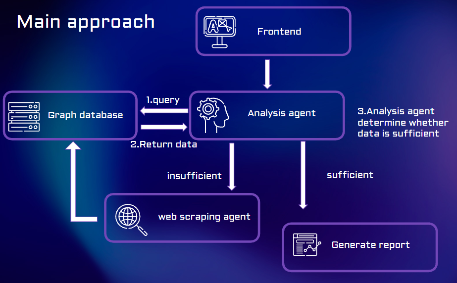

## Overview

This project implements an **agentic, multi-stage LLM system** designed for end-to-end information discovery, analysis, and knowledge structuring. The architecture follows a **Controller–Worker Agentic Orchestration Pattern**, where a central analysis agent coordinates multiple specialized agents to execute complex tasks in a deterministic and scalable pipeline.

User queries are processed through a structured workflow that includes web search, content scraping, semantic analysis, data extraction, and graph-based reasoning. Large Language Models are served via Ollama, while Neo4j is used to persist extracted knowledge and relationships, enabling iterative reasoning and retrieval-augmented generation (Graph-RAG).

By decomposing responsibilities across domain-specific agents, the system improves reliability, observability, and extensibility, making it suitable for research, market analysis, and complex knowledge-intensive applications.
## System flows

## Quick start
After you clone this repo, 
### 申請tavily API key
```
https://app.tavily.com/home
```
docker-compose.yml:
environment替換:
```
-TAVILY_API_KEY=your_api_key
and then run 
```
docker compose down
docker compose build
docker compose up
```
Can access front end by port3000 and database by port 7474

## Services
All services were composed in different container
## Services Architecture

All services are deployed as **independent Docker containers**, enabling modular development, isolation, and scalable orchestration.

### ollama
LLM inference service responsible for model loading and text generation. Supports NVIDIA GPU acceleration for improved performance.

### backend (neo4j)
Neo4j graph database service used to store and query structured knowledge for Graph-RAG workflows.  
Access URL: http://140.113.73.25:7474/browser/  
Account: `neo4j`  
Password: `password123`
MATCH (n)
DETACH DELETE n;

### analysis_agent
Core reasoning agent that orchestrates the inference workflow. It integrates search results, performs graph queries on Neo4j, and invokes downstream agents such as web scraping and data extraction.

### web_scraping_agent
Web crawling service responsible for fetching and cleaning web content, providing raw text for analysis and data extraction.

### data_extraction_agent
Information extraction service that uses LLMs to extract structured data from documents. Performance and stability are improved by limiting document count, content length, and concurrency.

### frontend
Frontend interface built with Vite and React, serving as the user interaction entry point. It communicates with the `web_search_agent` and backend agent system via HTTP.  
Access URLs:  
- http://localhost:3000/  


## Agent Logs

Start a specific agent:
```bash
docker compose up agent_name
```
```
docker-compose logs -f container
```


```
